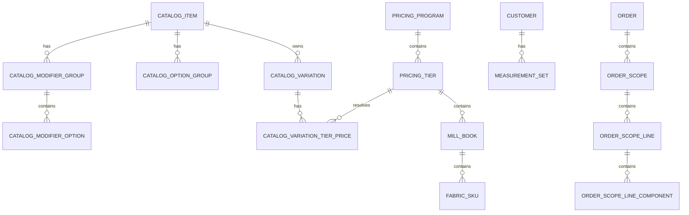
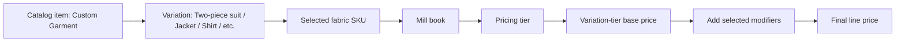

# Custom Pricing Relational Schema

This is the current prototype data model for custom pricing after the catalog-first cleanup.

The important framing:
- `catalog_item` and `catalog_variation` are the sellable things
- `fabric` is a price-resolving option, not a non-priced option
- `pricing_tier`, `mill_book`, and `fabric_sku` are internal reference data used to resolve the correct base amount
- `catalog_modifier_option` rows are the only additive pricing records

## Entity Relationship Diagram

## Pricing Resolution Flow

## Core Table Meanings

### Sellable catalog layer

| Table | Meaning |
| --- | --- |
| `catalog_items` | Top-level sellable product family. Currently this is `Custom Garment`. |
| `catalog_variations` | Individual sellable products like `Two-piece suit`, `Jacket`, `Shirt`, `Overcoat`. |
| `catalog_option_groups` | Operator-selected option groups. `fabric` is price-resolving; `buttons`, `lining`, `threads`, `lapel`, and `pocket_type` shape the build. |
| `catalog_modifier_groups` | Additive pricing groups like `canvas` and `custom_lining`. |
| `catalog_modifier_options` | Specific additive options like `Half canvas`, `Full canvas`, `Custom printed lining`. |
| `catalog_variation_tier_prices` | Base amount for one variation when the selected fabric resolves into one pricing tier. |

### Internal fabric-source layer

| Table | Meaning |
| --- | --- |
| `pricing_programs` | Internal pricing domains, currently `custom_suiting` and `custom_shirting`. |
| `pricing_tiers` | Internal tier records. The `floor_price` is the starting price for a **two-piece suit** or equivalent baseline variation in that tier, not for the fabric itself. |
| `mill_books` | Representative merchant-facing books or collections within one tier. |
| `fabric_catalog_items` | Representative SKUs within a mill book. QR values are stored exactly as scanned when available. |

## Relationship Rules

- Every `catalog_variation` belongs to one `catalog_item`.
- Every `catalog_variation` belongs to one pricing program by `program_key`.
- Every `catalog_variation_tier_price` joins one variation to one pricing tier.
- Every `pricing_tier` belongs to one `pricing_program`.
- Every `mill_book` belongs to one `pricing_tier`.
- Every `fabric_catalog_item` belongs to one `mill_book`.
- Fabric does not directly store the final garment price.
- Fabric resolves the tier, and the tier plus variation resolves the base amount.
- Modifiers add on top of that base amount.

## Current Business Rules Captured in the Schema

- `Shirt` uses `custom_shirting`.
- All other current custom garments use `custom_suiting`.
- Canvas applies only where the variation supports canvas.
- Custom printed lining applies only where the variation supports custom lining.
- Overcoat is currently not canvas-enabled.
- Three-piece garments are standalone sellable variations, not vest add-ons.

## Operator Mental Model

The clean way to read the schema is:

1. We sell a **variation**.
2. We choose a **fabric**.
3. That fabric resolves to an internal **tier**.
4. The variation + tier gives us the **base price**.
5. Selected **modifiers** add on top.

So the phrase "fabric is non-priced" is not correct.

The better phrasing is:
- fabric is a **price-resolving option**
- modifiers are **direct price add-ons**
- the rest are **build options**
